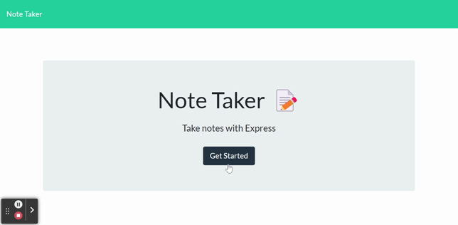

# Note Taker
  

  ## Description

  This application allows users to write, save, and delete notes. When the application opens, the user is presented with the landing page that contains a button entitled "Get Started" which links to the notes page. Existing notes appear in the left-hand column. On the right is an empty field for user to enter a new note title and the note's text. A save icon appears once the title and body of the note are filled out. When the save icon is clicked, the note's contents are saved, and it will appear in the left-hand column. When the user clicks on a saved note in the left-hand column, it's contents will appear in the right-hand column for viewing. When the delete button is clicked, the note will be removed from the existing notes column. When the user clicks the "+" button in the navigation bar, empty fields are presented to enter a new note in the right-hand column. 

  ## Table of Contents
  * [Installation](#installation)
  * [Preview](#preview)
  * [Deployed Application](#deployed-application)
  * [License](#license)
  * [Questions](#questions)

  ## Installation

  To run any necessary installations use the following command:

```
  npm install
```

  ## Preview:

  The following GIF demonstrates the Note Taker's appearance and functionality:

  

  ## Deployed Application

  Click [here](https://carolyn-note-taker.herokuapp.com/) to view the deployed applicaiton on Heroku.

  ## License

   This application is licensed under MIT.

  ## Questions

If you have any questions about this project please email me directly at [cghudson@uwalumni.com](mailto:cghudson@uwalumni.com) .

View more of my projects on [GitHub](https://github.com/cghudson).